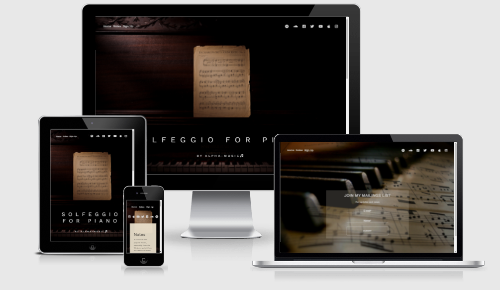
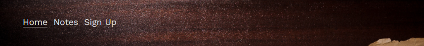
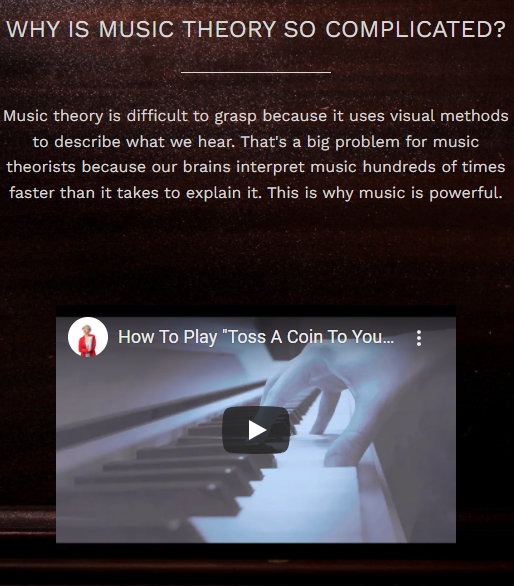
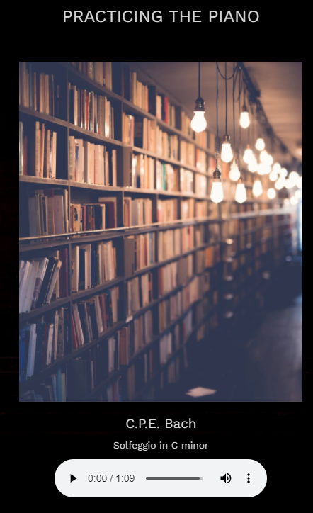
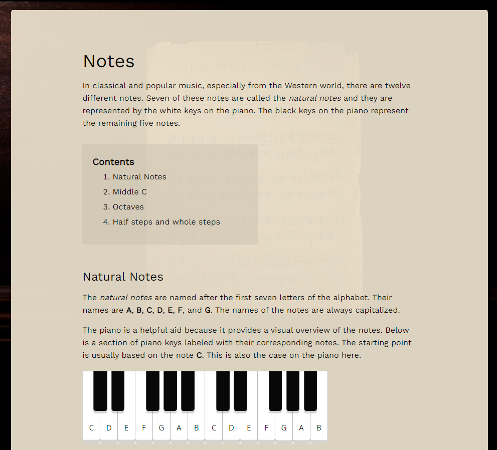
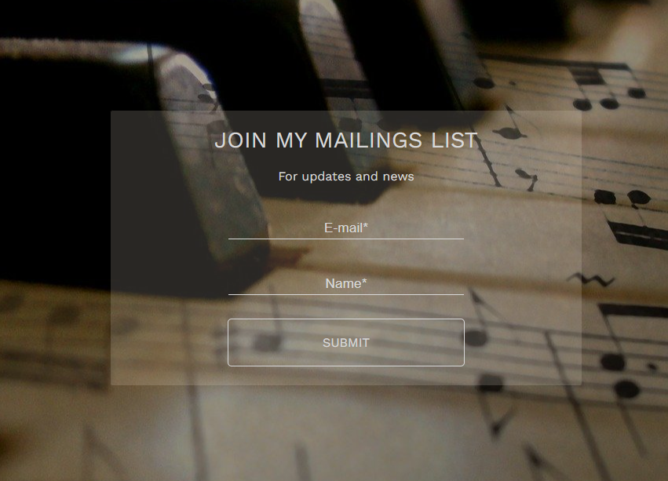

# Solfeggio for Piano

An informational website for anyone interested in music, and especially in theory of music. A useful information for beginner piano players; some basic concepts of notes, their types and classification.

Subscription form is available for the actual updates related to theory of music.

<a href="https://folkor1.github.io/Work-repo/index.html" target="_blank">Solfeggio for Piano project link</a>

## Features

The website is designed so that the new features can be easily added with no harm to the initial design concept.

### Existing features

- __Navigation Menu__

  - The navigation menu allows user to navigate throught the website and has fixed position on all pages - Home, Notes and Signup.

    
  
- __Social Media Links__

  - Links to the mainstream social media and relevant resources: Spotify, SoundCloud, Facebook, Twitter, YouTube, Apple Music, Instagram.
  - This section will help the user to find thematic groups, news and discussions.

    

- __Embedded video__

  - A visual demonstration of a technique that might be useful for beginner piano players.
    
    

- __Embedded audio__

  - In this section the user can play a melody with provided audio controls.

    

- __Notes page__

  - This section allows the user to familiarize with the basic concepts of notes with explaining images.
  - Anchor links will help to jump to different paragraphs in a more convenient manner than scrolling.

    

- __Signup form__

  - Signup form is designed for subscription to relevant news and updates.
  - E-mail and name fields are mandatory for submitting the form.

    
    
- __Adaptive design__

   - The website is designed to suit different scales of the display, starting from large 1600px and to minimum of 350px.

### Features to implement

- More informational pages like 'Notes' could be added, such as 'Intervals', 'Clefs', 'Accidentals', etc.
- The 'Notes' link could be transformed to drop-down menu for convenience, keeping the initial website design.

## Testing

Testing was performed on different stages of the project, with the final, more comprehensive after deployment.

- Tested all links(navigation links, social media links, anchor links, signup form completion link) to make sure that there are no broken ones, leading to error page.

- Text font color was tested to ensure that it's readible when positioned on the bright part of the background image.

- Also tested different elements of the website to make sure that they are correctly alligned and not clipping/overlapping when changing the screen size. Minimum screen size that keeps the elements well aligned: 350px. Checked images in different screen sizes to ensure that they are correctly scaling with no streching.

- Tested signup form to make sure that make sure that input fields are working as intended, e.g. e-mail field only accepting the input in the correct form. Also tested the maximum amount of symbols that allowed in e-mail/name fields(was set 50 in the code).

Some of the bugs that were identified on the course of testing:

 - Misaligned footer on different pages.

 - Unreadable text due to text color is smaller screen sizes.

 - Inconsistent autofill background color in signup form.

All the bugs found were fixed and passed the final testing. 

## Validator testing

 - HTML
   - No errors identified in <a href="https://validator.w3.org/" target="_blank">W3C HTML validator</a>

 - CSS
   - No errors identified in <a href="https://jigsaw.w3.org/css-validator/#validate_by_uri" target="_blank">W3C CSS validator</a>

## Deployment

The project was deployed to GitHub following by these steps:

 1. Login to GitHub
 2. Select the repository
 3. Navigate to 'Settings' -> 'Pages'
 4. In the 'Source' drop-down menu select 'main'
 5. Press 'Save'
 6. The link becomes available straight away and the project loads once the building process is finished

## Credits

Design for the main page was partially taken from <a href="https://www.wix.com/" target="_blank">WIX</a>

Images(excluding piano keyboard) were taken from <a href="https://pixabay.com/" target="_blank">Pixabay</a>

Paragraph text was taken from the following resources: <a href="https://www.musicca.com/" target="_blank">MUSICCA</a> and <a href="https://www.completesongwriter.com/" target="_blank">Complete Songwriter</a>

The icons were taken from <a href="https://fontawesome.com/" target="_blank">Font Awesome</a>

Font was taken from <a href="https://fonts.google.com/" target="_blank">Google Fonts</a>

The following resources were used for solutions and ideas:

 - <a href="https://www.w3schools.com/" target="_blank">W3Schools</a>

 - <a href="https://stackoverflow.com/" target="_blank">Stack Overflow</a>
